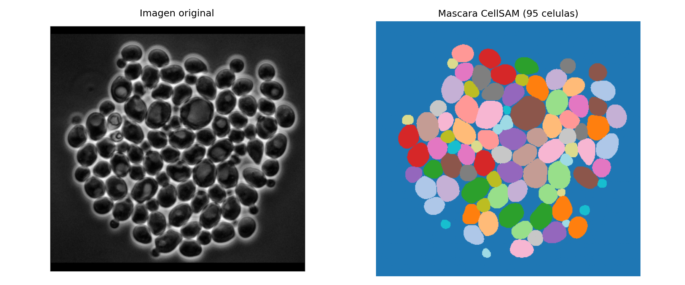
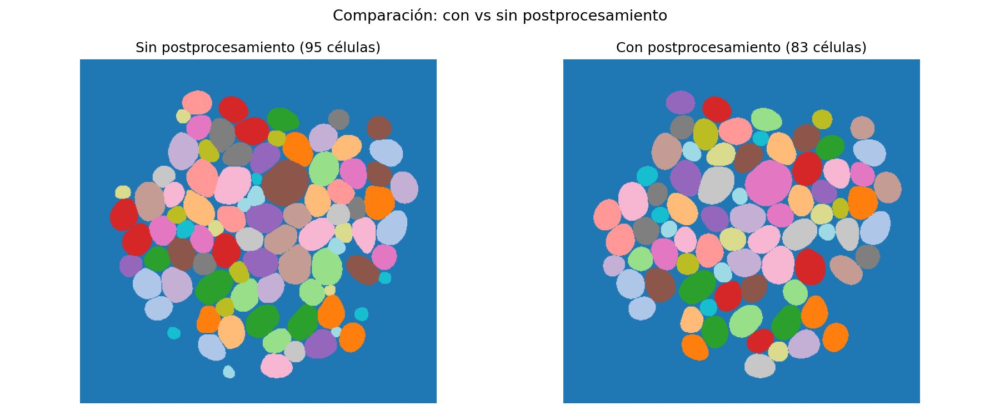
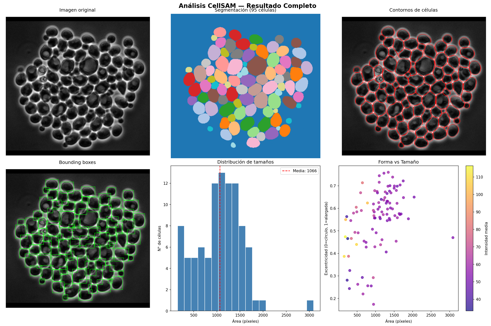

# Apuntes CellSAM — Cómo funciona y qué nos dice

> Imagen analizada: `images/celulas.png.png` — contraste de fase, células en suspensión
> Scripts usados: `test_cellsam.py`, `analisis_completo.py`

---

## ¿Qué es CellSAM?

CellSAM es un modelo de segmentación de células basado en **SAM (Segment Anything Model)** de Meta, adaptado específicamente para imágenes de microscopía. Su arquitectura combina dos partes:

1. **AnchorDETR** — detecta las células y genera bounding boxes (cajas delimitadoras)
2. **SAM** — usa esas cajas para generar máscaras precisas píxel a píxel

No necesita que le digas dónde están las células: las encuentra solo.

### Modalidades que soporta

| Modalidad | Ejemplos |
|---|---|
| Contraste de fase | Levaduras, células de mamífero en suspensión |
| Fluorescencia | Núcleos teñidos con DAPI, GFP |
| Brightfield | Células en cultivo |
| Microscopía electrónica | Bacterias, biofilms |
| H&E | Histología de tejidos |

---

## Paso 1 — Cargar el modelo

```python
from cellSAM import get_model
model = get_model()
```

- La primera vez descarga los pesos desde `users.deepcell.org` usando tu `DEEPCELL_ACCESS_TOKEN`
- Los cachea en `~/.deepcell/models/cellsam_v1.2/`
- La siguiente vez los carga directo del disco (instantáneo)

### Variante: modelo local (pesos propios)

```python
from cellSAM import get_local_model
model = get_local_model("ruta/a/mis_pesos.pt")
```

Útil cuando entrenas tu propio modelo (para bacterias, por ejemplo) y quieres cargarlo con la misma interfaz.

### Variante: elegir versión o modelo

```python
model = get_model(model="cellsam_general", version="1.2")
# model="cellsam_extra"  → entrenado con datasets adicionales (más robusto)
# model="cellsam_general" → solo datasets del paper (reproducibilidad)
```

---

## Paso 2 — Segmentación básica

```python
mask, embedding, bboxes = segment_cellular_image(img, model=model, device="cpu")
```

### ¿Qué devuelve?

| Variable | Tipo | Descripción |
|---|---|---|
| `mask` | array 2D (H x W) | Cada píxel tiene un número: 0=fondo, 1=célula 1, 2=célula 2... |
| `embedding` | array numérico | Representación interna de la imagen aprendida por el modelo |
| `bboxes` | array de coordenadas | [x1, y1, x2, y2] de cada célula detectada |

### Cómo funciona internamente

```
Imagen → Normalización → AnchorDETR → Bounding boxes → SAM → Máscara final
```

1. La imagen se normaliza (percentil + CLAHE para mejorar contraste)
2. AnchorDETR analiza la imagen completa y propone cajas donde cree que hay células
3. SAM toma cada caja y segmenta con precisión los píxeles de esa célula
4. Se eliminan máscaras muy pequeñas (ruido, `min_size=25 px`)

### Todos los parámetros disponibles

```python
segment_cellular_image(
    img,                    # imagen numpy (H,W) o (H,W,C)
    model=model,
    normalize=True,         # normalización de contraste (percentil + CLAHE)
    postprocess=False,      # suavizado y limpieza de bordes
    remove_boundaries=False,# eliminar 1 px de borde compartido entre células
    bounding_boxes=None,    # pasar cajas manuales [[x1,y1,x2,y2], ...]
    bbox_threshold=0.4,     # confianza mínima para aceptar una caja (0-1)
    fast=False,             # inferencia en batch (más rápido, alpha)
    device="cpu",           # "cpu" o "cuda"
)
```

### Resultado en nuestra imagen

- **95 células** detectadas
- Imagen de **contraste de fase** (células oscuras con halo brillante)

---

## Paso 3 — Ver la máscara



*Izquierda: imagen original. Derecha: máscara donde cada color es una célula diferente.*

La máscara es simplemente un array donde cada número identifica una célula:

```
0 0 0 0 0 0
0 1 1 0 2 0   ← célula 1 y célula 2
0 1 1 0 2 0
0 0 0 0 0 0
```

Donde `0` = fondo, `1` = célula 1, `2` = célula 2, etc.

---

## Paso 4 — Postprocesamiento

```python
mask_post, _, _ = segment_cellular_image(img, model=model, postprocess=True)
```

El postprocesamiento aplica sobre cada máscara individual:
- `binary_opening` → elimina picos y protuberancias pequeñas
- `binary_closing` → rellena huecos pequeños dentro de la célula
- Filtro gaussiano (sigma=3) → suaviza el borde
- `remove_small_regions` → elimina fragmentos sueltos

### Comparación



| | Sin postprocesamiento | Con postprocesamiento |
|---|---|---|
| Células detectadas | **95** | **83** |
| Efecto | Bordes fieles al modelo | Bordes más suaves, elimina ruido |

**¿Cuándo usar postprocesamiento?**
- Imágenes ruidosas → sí
- Células muy juntas → depende
- Bacterias pequeñas → con cuidado, puede eliminar objetos pequeños

---

## Paso 5 — Bounding boxes manuales

```python
mis_cajas = [
    [50, 30, 120, 100],   # [x1, y1, x2, y2] célula 1
    [200, 150, 280, 220], # célula 2
]
mask, _, _ = segment_cellular_image(img, model=model, bounding_boxes=mis_cajas)
```

En lugar de dejar que AnchorDETR detecte las células, tú le dices exactamente dónde están. Útil cuando:

- Tienes detecciones de otro algoritmo
- Quieres segmentar solo una región específica
- AnchorDETR falla en algunos casos borde

---

## Paso 6 — Métricas por célula con `regionprops`

```python
from skimage.measure import regionprops
props = regionprops(mask, intensity_image=img)
```

`regionprops` analiza cada región numerada de la máscara y calcula propiedades geométricas e intensidad.

### Métricas disponibles y su significado

| Métrica | Fórmula / Significado | Nuestra imagen |
|---|---|---|
| `area` | N° de píxeles que ocupa la célula | Media: **1065 px²**, Rango: 150–3090 |
| `perimeter` | Longitud del borde en píxeles | Media: **117 px**, Rango: 44–207 |
| `equivalent_diameter_area` | Diámetro si fuera un círculo: `√(4·área/π)` | Media: **35.7 px**, Rango: 14–63 |
| `eccentricity` | Qué tan alargada: 0=círculo perfecto, 1=línea recta | Media: **0.55** |
| `solidity` | área / área_convexa. Qué tan sólida sin huecos | Media: **0.97** |
| `intensity_mean` | Brillo promedio dentro de la célula | — |
| `centroid` | Coordenada (y, x) del centro de masa | — |
| `bbox` | Caja delimitadora (y1, x1, y2, x2) | — |

### Interpretación de nuestra imagen

- **Excentricidad 0.55** → moderadamente ovaladas, no perfectamente redondas
- **Solidez 0.97** → casi perfectamente sólidas, sin huecos ni entrantes
- **Área 150–3090 px²** → variedad de tamaños, distintas etapas o planos de foco

---

## Paso 7 — Visualizaciones generadas



| Panel | Qué muestra |
|---|---|
| Imagen original | La entrada al modelo |
| Segmentación | Máscara con colores por célula |
| Contornos en rojo | Dónde el modelo trazó los bordes |
| Bounding boxes verdes | Las cajas que AnchorDETR detectó |
| Histograma de áreas | Distribución de tamaños de célula |
| Excentricidad vs Área | Relación forma/tamaño coloreada por intensidad |

---

## Paso 8 — Exportar a CSV

```python
import pandas as pd
df.to_csv("resultados_celulas.csv", index=False)
```

Una fila por célula. Se puede abrir en Excel o analizar con pandas.

---

## Paso 9 — Imágenes grandes: WSI con Dask

```python
from cellSAM import cellsam_pipeline
mask = cellsam_pipeline(img, use_wsi=True)
```

Para imágenes de escáner de patología (whole-slide) con miles de células. Internamente:

1. Divide la imagen en **tiles** solapados
2. Segmenta cada tile en paralelo con **Dask**
3. Reconstruye la máscara completa uniendo los tiles
4. Puede usar múltiples GPUs si están disponibles

```python
# Pipeline simple (elige automáticamente WSI o normal según tamaño)
mask = cellsam_pipeline(img, use_wsi=False)  # fuerza modo normal
mask = cellsam_pipeline(img, use_wsi=True)   # fuerza modo WSI
```

---

## Paso 10 — Plugin interactivo: Napari

Napari es un visor de imágenes científicas con interfaz gráfica. CellSAM tiene un plugin que permite segmentar de forma interactiva.

### Cómo lanzarlo

```bash
cellsam napari
```

### Qué puedes hacer en la interfaz

| Acción | Cómo |
|---|---|
| Cargar imagen | Arrastrar archivo al visor o `File > Open` |
| Segmentar todo automáticamente | Botón **Segment All** |
| Dibujar una caja manual | Seleccionar herramienta rectángulo y dibujar — segmenta al soltar |
| Confirmar segmentación manual | Botón **Confirm Annot.** o tecla `C` |
| Cancelar anotación | Botón **Cancel Annot.** o tecla `X` |
| Borrar máscara actual | Botón **Clear mask** |
| Reiniciar todo | Botón **Reset** (usar antes de cargar nueva imagen) |
| Imagen multicanal | Seleccionar canal nuclear y/o de célula completa en los desplegables |

### Capas que crea automáticamente

| Capa | Descripción |
|---|---|
| `Segmentation Overlay` | Resultado de "Segment All" con colores por célula |
| `Drawn masks` | Máscaras de cajas dibujadas manualmente (en rojo) |
| `Bounding boxes` | Cajas verdes sobre la imagen |

### Flujo típico de uso

```text
1. cellsam napari
2. Arrastrar imagen al visor
3. Clic en "Segment All" → esperar resultado automático
4. Si hay células mal segmentadas → dibujar caja manual → se segmenta al soltar
5. Clic en "Confirm Annot." para agregar esa célula al overlay
6. Exportar máscara desde Napari: File > Save Layer(s)
```

---

## Paso 11 — Descargar datos de entrenamiento

```python
from cellSAM import download_training_data
download_training_data(version="1.2")  # descarga a ~/.deepcell/datasets/
```

Descarga el dataset completo con el que se entrenó CellSAM. Sirve para:

- Ver qué tipo de imágenes usaron y en qué formato
- Entender cómo estructurar tus propios datos de bacterias
- Re-entrenar o hacer fine-tuning del modelo

Versiones disponibles: `"1.0"`, `"1.2"` (la más reciente)

---

## Resumen de todas las funciones

```python
from cellSAM import (
    get_model,              # cargar modelo desde DeepCell
    get_local_model,        # cargar modelo desde archivo local
    segment_cellular_image, # segmentar una imagen
    cellsam_pipeline,       # pipeline completo (incluye WSI)
    CellSAM,                # clase del modelo (para uso avanzado)
    download_training_data, # descargar dataset de entrenamiento
)
```

---

## Lo que aprendimos y aplica a bacterias

| Aspecto | Células (esta imagen) | Bacterias (tu proyecto) |
|---|---|---|
| Forma | Ovaladas, excentricidad ~0.55 | Más alargadas, excentricidad más alta (~0.8+) |
| Tamaño | 35 px de diámetro equiv. | Mucho más pequeñas, ~3–10 px |
| Densidad | ~95 por imagen | Cientos o miles |
| `min_size` | 25 px (ok) | Bajar a 5–10 px para no perder bacterias |
| Postprocesamiento | Opcional | Con cuidado, puede eliminar objetos pequeños |
| WSI | Opcional | Necesario para imágenes grandes |
| Modalidad | Contraste de fase | Fase, fluorescencia, brightfield |
| Napari | Útil para revisar | Esencial para corregir casos difíciles |

**Para bacterias los principales ajustes serán:**

1. `min_size` → bajar de 25 a 5–10 px
2. `bbox_threshold` → ajustar si detecta de más o de menos
3. Fine-tuning con imágenes propias de bacterias
4. Usar `get_local_model()` una vez tengas pesos propios entrenados

---

## Archivos generados en esta sesión

| Archivo | Contenido |
|---|---|
| `resultado_segmentacion.png` | Imagen original + máscara básica |
| `analisis_completo.png` | 6 paneles de análisis |
| `comparacion_postprocesamiento.png` | Con vs sin postprocesamiento |
| `resultados_celulas.csv` | Métricas de las 95 células en formato tabla |
| `test_cellsam.py` | Script básico de prueba |
| `analisis_completo.py` | Script de análisis completo |
